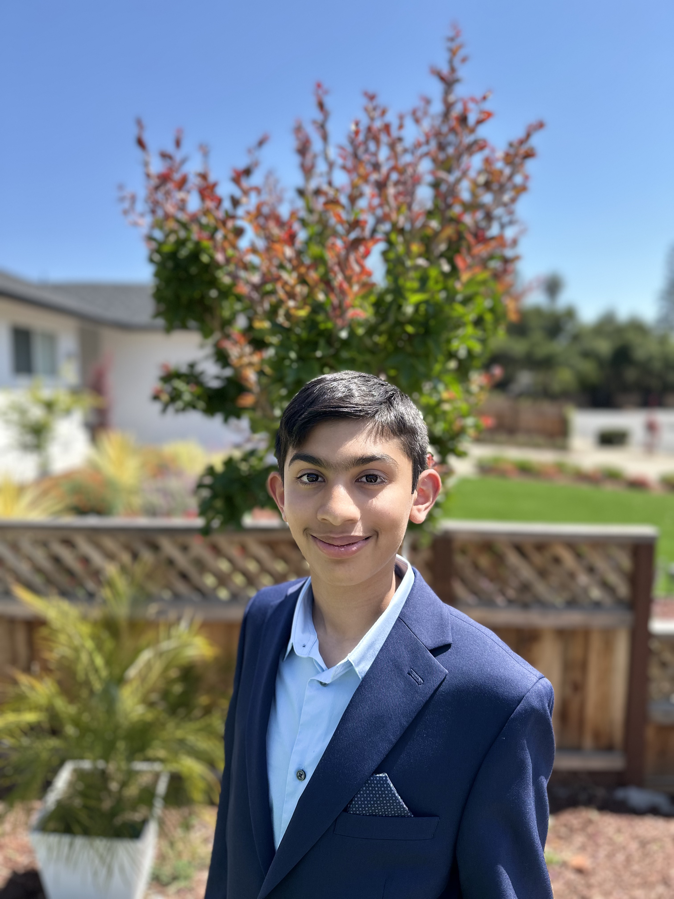

# IoT Pollution Monitor
Is it safe outside? The IoT Pollution Monitor uses FeatherWing boards with arduino IDE to keep track of the temperature and air quality outside. The data is sent to an Adafruit browser where pollution data can be accessed from anywhere in the world! This project can track harmful radiation during natural disasters and prevent people from going into dangerous areas.

(Replace this text with a brief description (2-3 sentences) of your project. This description should draw the reader in and make them interested in what you've built. You can include what the biggest challenges, takeaways, and triumphs from completing the project were. As you complete your portfolio, remember your audience is less familiar than you are with all that your project entails!)

You should comment out all portions of your portfolio that you have not completed yet, as well as any instructions:
```HTML 
<!--- This is an HTML comment in Markdown -->
<!--- Anything between these symbols will not render on the published site -->
```

| **Engineer** | **School** | **Area of Interest** | **Grade** |
|:--:|:--:|:--:|:--:|
| Rishaan D | Fremont High School | Electrical Engineering | Incoming Freshman




```HTML
# Modifications 

**Don't forget to replace the text below with the embedding for your modifications video. Go to Youtube, click Share -> Embed, and copy and paste the code to replace what's below.**

<iframe width="560" height="315" src="https://www.youtube.com/embed/F7M7imOVGug" title="YouTube video player" frameborder="0" allow="accelerometer; autoplay; clipboard-write; encrypted-media; gyroscope; picture-in-picture; web-share" allowfullscreen></iframe>

For your final milestone, explain the outcome of your project. Key details to include are:
- what are the modifications?
- What your biggest challenges and triumphs were at BSE
- A summary of key topics you learned about
- What you hope to learn in the future after everything you've learned at BSE
  
```

# Final Milestone

**Don't forget to replace the text below with the embedding for your milestone video. Go to Youtube, click Share -> Embed, and copy and paste the code to replace what's below.**

<iframe width="560" height="315" src="https://www.youtube.com/embed/F7M7imOVGug" title="YouTube video player" frameborder="0" allow="accelerometer; autoplay; clipboard-write; encrypted-media; gyroscope; picture-in-picture; web-share" allowfullscreen></iframe>

For your final milestone, explain the outcome of your project. Key details to include are:
- What you've accomplished since your previous milestone
- What your biggest challenges and triumphs were at BSE
- A summary of key topics you learned about
- What you hope to learn in the future after everything you've learned at BSE


# Second Milestone

**Don't forget to replace the text below with the embedding for your milestone video. Go to Youtube, click Share -> Embed, and copy and paste the code to replace what's below.**

<iframe width="560" height="315" src="https://www.youtube.com/embed/y3VAmNlER5Y" title="YouTube video player" frameborder="0" allow="accelerometer; autoplay; clipboard-write; encrypted-media; gyroscope; picture-in-picture; web-share" allowfullscreen></iframe>

For your second milestone, explain what you've worked on since your previous milestone. You can highlight:
- Technical details of what you've accomplished and how they contribute to the final goal
- What has been surprising about the project so far
- Previous challenges you faced that you overcame
- What needs to be completed before your final milestone 

# First Milestone

**Don't forget to replace the text below with the embedding for your milestone video. Go to Youtube, click Share -> Embed, and copy and paste the code to replace what's below.**

<iframe width="560" height="315" src="https://www.youtube.com/embed/CaCazFBhYKs" title="YouTube video player" frameborder="0" allow="accelerometer; autoplay; clipboard-write; encrypted-media; gyroscope; picture-in-picture; web-share" allowfullscreen></iframe>

For your first milestone, describe what your project is and how you plan to build it. You can include:
- An explanation about the different components of your project and how they will all integrate together
- Technical progress you've made so far
- Challenges you're facing and solving in your future milestones: Putting breadboards together with no previous knowledge/instruction. (used research to solve).
- What your plan is to complete your project

# Schematics 
Here's where you'll put images of your schematics. [Tinkercad](https://www.tinkercad.com/blog/official-guide-to-tinkercad-circuits) and [Fritzing](https://fritzing.org/learning/) are both great resoruces to create professional schematic diagrams, though BSE recommends Tinkercad becuase it can be done easily and for free in the browser. 

# Code
Here's where you'll put your code. The syntax below places it into a block of code. Follow the guide [here]([url](https://www.markdownguide.org/extended-syntax/)) to learn how to customize it to your project needs. 

```c++
void setup() {
  // put your setup code here, to run once:
  Serial.begin(9600);
  Serial.println("Hello World!");
}

void loop() {
  // put your main code here, to run repeatedly:

}
```


# Bill of Materials
Here's where you'll list the parts in your project. To add more rows, just copy and paste the example rows below.
Don't forget to place the link of where to buy each component inside the quotation marks in the corresponding row after href =. Follow the guide [here]([url](https://www.markdownguide.org/extended-syntax/)) to learn how to customize this to your project needs. 

| **Part** | **Note** | **Price** | **Link** |
|:--:|:--:|:--:|:--:|
| Adafruit Feather M4 Express featuring ATSAMD51 | Stores code and processing files | $22.95 | <a href="https://www.adafruit.com/product/3857"> Link </a> |
| Adafruit AirLift FeatherWing | Uses ESP32 to connect to WiFi and transfer data | $12.95 | <a href="https://www.adafruit.com/product/4264"> Link </a> |
| PM2.5 Air Quality Sensor and breadboard adapter kit | Monitors air quality using lasers and dust concentrations | $39.95 | <a href="https://www.adafruit.com/product/3686"> Link </a> |
| Adafruit BME280 12C or SPI | Temperature Humidity Pressure Sensor | $14.95 | <a href="https://www.adafruit.com/product/2652"> Link </a> |
| FeatherWing Doubler | Feather Board prototyping add-on | $7.50 | <a href="https://www.adafruit.com/product/2890"> Link </a> |
| Flanged Weatherproof Enclosure with PG-7 Cable Glands | An enclosure to protect projects from weather | $9.95 | <a href="https://www.adafruit.com/product/3931"> Link </a> |
| Silicone Stranded Cable | 4 connected 30 AWG wires | $1.95 | <a href="https://www.adafruit.com/product/3889"> Link </a> |
| Part | what it is | $price | <a href="https://www.adafruit.com/product/3686"> Link </a> |

# Starter Project

<iframe width="560" height="315" src="https://www.youtube.com/embed/9fetkc7HMbk?si=WrSm_SIhvWVOaIxo" title="YouTube video player" frameborder="0" allow="accelerometer; autoplay; clipboard-write; encrypted-media; gyroscope; picture-in-picture; web-share" referrerpolicy="strict-origin-when-cross-origin" allowfullscreen></iframe>

My starter project is a retro arcade console. The console has 5 levels of games that can be played. The red button is used to start and switch off the console. The 4 buttons on the bottom left are for movements in every direction. The top yellow button on the right rotates pieces and begins the game. This is a fun portible game.

I chose this as my starter project to enhance my skills in soldering. The project helped me learn how to make proper cone-shaped joints and practice with multiple pieces. Some of the joints were very small and close together, making it challenging to solder it without a short circut, or connecting two close-by pins. This helped me practice soldering with pins and pads of various sizes and enabled me to practice advanced soldering skills.


Parts: USB socket, 2 dot matrixes, 1 capasitor, 1 buzzer, 6 buttons, 6 key caps, 1 power switch, 1 battery box, 3 AAA batteries, 6 acrylic plates, 2 wires, digital tube. 

| **#** | **Part** | **#** | **Part**|
|:--:|:--:|:--:|:--:|
| 1 | 1 Buzzer | 11 | 6 Buttons |
| 2 | 1 Electric Capacitor | 12 | 6 yellow button caps |
| 3 | 1 Micro USB | 13 | 1 PCB |
| 4 | 1 Power Cable | 14 | 8 M3x5mm Screw |
| 5 | 1 Switch | 15 | 2 M3x8mm Screw |
| 6 | 1 Red Switch Cap | 16 | 1 AAA Battery case |
| 7 | 1 Digitron display | 17 | 1 Acrylic shell |
| 8 | 1 IC Chip |  |  |
| 9 | 1 IC Socket |  |  |
| 10 | 2 LED dot matrix modules |  |  |


# Other Resources/Examples
One of the best parts about Github is that you can view how other people set up their own work. Here are some past BSE portfolios that are awesome examples. You can view how they set up their portfolio, and you can view their index.md files to understand how they implemented different portfolio components.
- [Starter project parts](https://www.hackster.io/lewisdiy/build-your-own-game-console-kit-play-the-classic-games-5ca95f)
- [IoT pollution monitor guide](https://learn.adafruit.com/diy-air-quality-monitor/overview)
- [Example 3](https://arneshkumar.github.io/arneshbluestamp/)

To watch the BSE tutorial on how to create a portfolio, click here.
