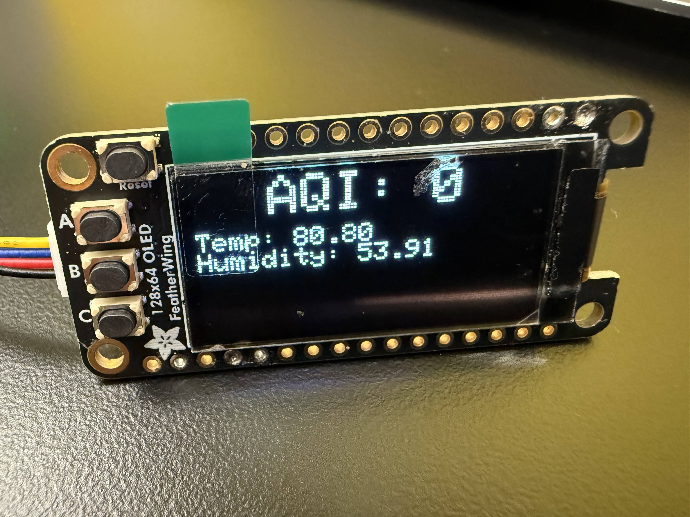
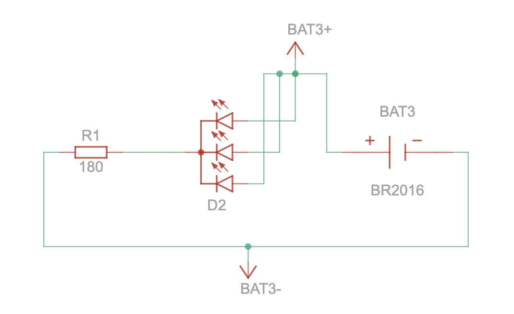
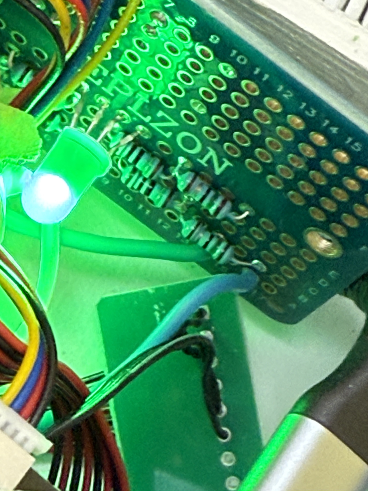
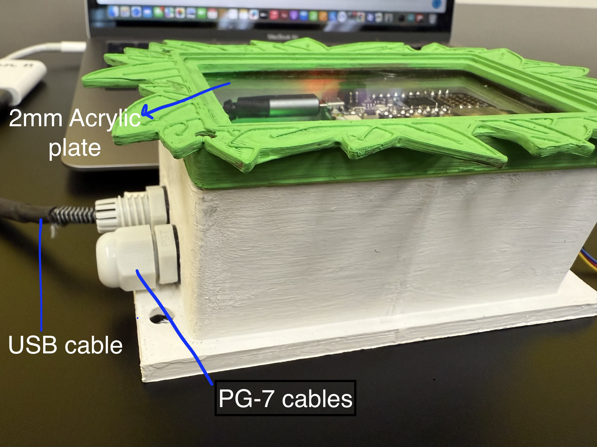
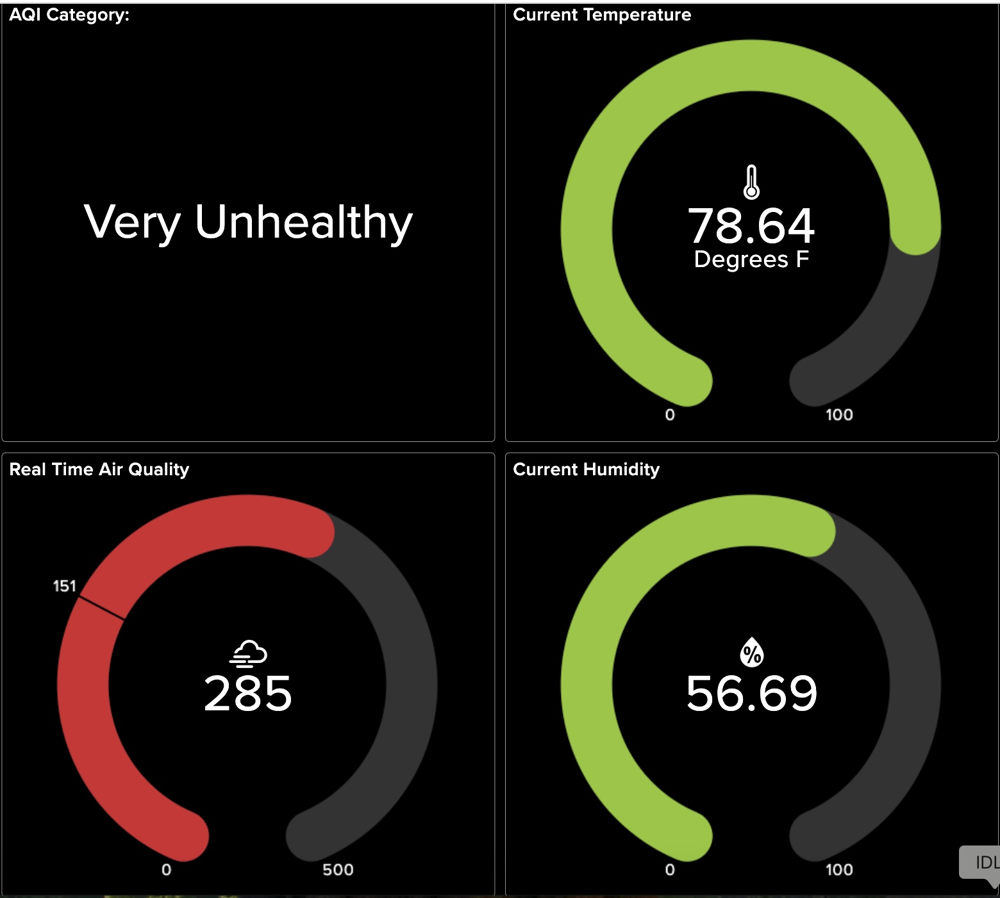
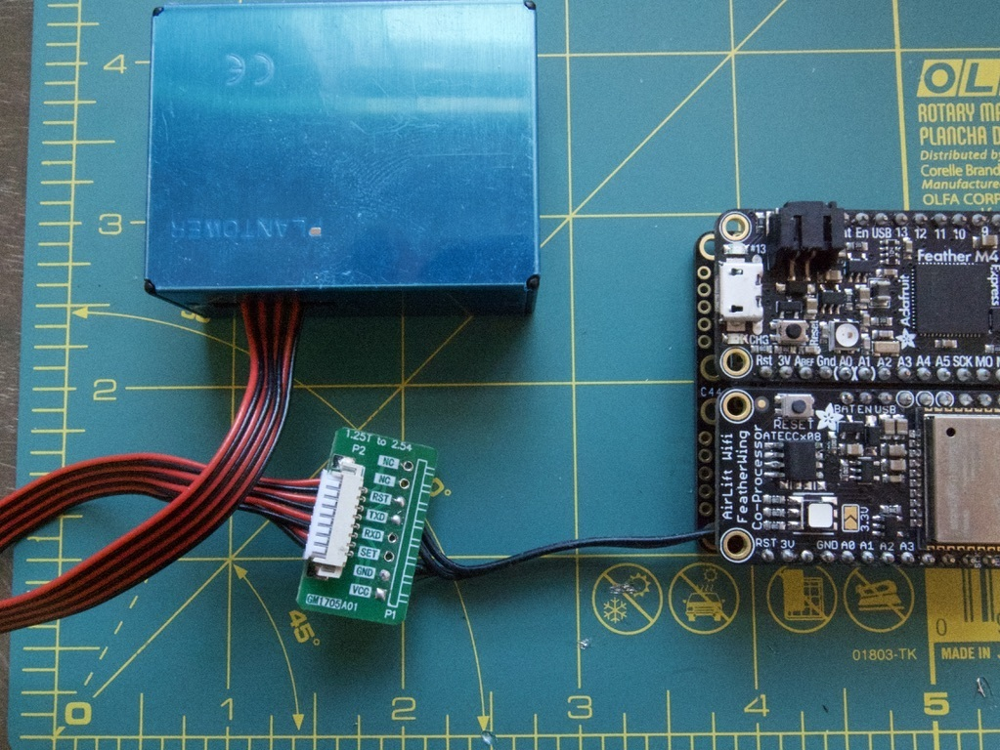
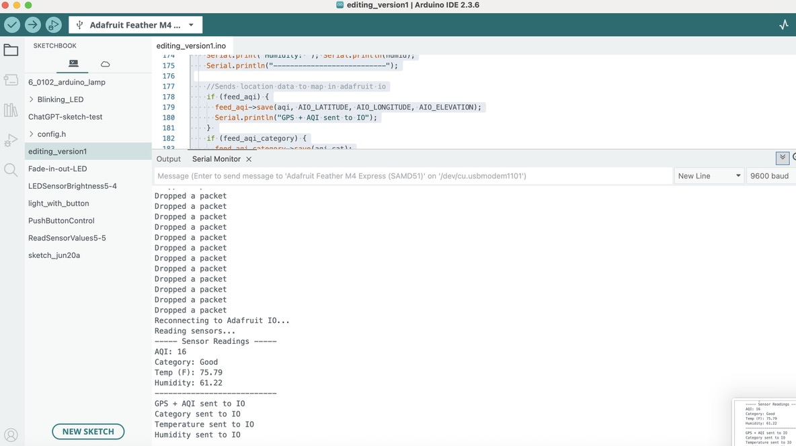
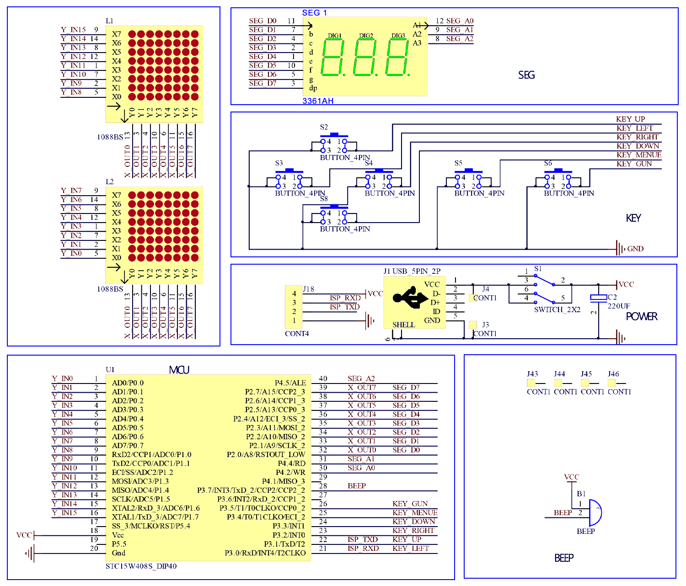

# IoT Pollution Monitor
Is it safe outside? Would you like to know? The IoT Pollution Monitor uses FeatherWing boards with arduino IDE to keep track of the temperature and air quality outside. The data is sent to an Adafruit IO browser where pollution data can be accessed online from anywhere in the world! This project can track harmful radiation during natural disasters and prevent people from going into dangerous areas. This IoT Pollution Monitor can make the environment around where it is placed safer and inform users from potential threats that need to be dealt with. It also doubles as a weather reporting monitor, giving data for humidity and temperature in the area.

| **Engineer** | **School** | **Area of Interest** | **Grade** |
|:--:|:--:|:--:|:--:|
| Rishaan D | Fremont High School | Electrical Engineering | Incoming Freshman |


<!--

(Use:)

**Don't forget to replace the text below with the embedding for your modifications video. Go to Youtube, click Share -> Embed, and copy and paste the code to replace what's below.**

<iframe width="560" height="315" src="https://www.youtube.com/embed/F7M7imOVGug" title="YouTube video player" frameborder="0" allow="accelerometer; autoplay; clipboard-write; encrypted-media; gyroscope; picture-in-picture; web-share" allowfullscreen></iframe>

-->
# Modifications

### LED modification

  

This modification uses a RGB cathode LED. This means this LED connects to the ground (-) and can light up in any color. The colors correspond to the AQI category in the area. The colors are the same as the national [air quality index colors](https://www.airnow.gov/aqi/aqi-basics/) for the seperate categories. 

The RGB cathode requires a 2.2 voltage for red, and a 3.3 voltage for green and blue. This makes the red LED circut require it's own seperate voltage divider. This is different from the green and blue circuts that just need one or two resistors. This modification gave me the expierence of learning a whole new topic and doing electrical math calculations. Knowledge on voltage dividers is helpful for keeping circuts and projects safe to use.

### OLED display modification


The OLED screen used for this modification is the SH1107 OLED FeatherWing. The dimensions are 68x128mm. The OLED screen is used to visually display sensor data from where the IoT pollution monitor is located. This makes it possible to see the information even if the internet is down or if it is not possible to open adafruit io. The OLED screen displays the temperature, humidity, and displays AQI in a larger font.

The OLED sceen brought me to a challenge with its wiring. When the OLED screen was wired to the featherWing Doubler and the corresponding pins on the featherM4 express, the adafruit io connection would drop likely due to power consumption. To approach this problem, I created a seperate 3.3V power circut and connected it to the OLED screen. After the problem kept persisting, I learned about STEMMA QT inputs and decided to use a STEMMA QT wire.


### What I learned at BlueStamp Engineering

BlueStamp engineering allowed me to explore different types of microchip controllers I had never worked with before. At first I only knew how to use arduinos, but now I know how to use ESP32's and their wifi capabilities. I also learned how to do wiring and splicing at bluestamp. Splicing is spliting a wire and then soldering it back together. I used this to place the USB cable between the wall of the case. 

The most important topic I learned at bluestamp was voltage dividers and ohm's law. I learned this from the LED modification. At first, I would just pick up any resistor and attach it to a wire connected to the LED. I learned that this is a problem because a high voltage could damage components in the project and a low voltage would result in the LED not functioning properly. Through bluestamp, I learned formulas such as V=IR to solve for voltage dividers and make the LED circut. I also became very good at reading the resistors to find their resistance.


### Next steps

For this project, I am going to replace the FeatherM4 express, AirLift FeatherWing, and the FeatherWing Doubler and use a ESP32 instead. This will improve the wifi connection and connection to adafruit io. I might also add a noise pollution sensor or take air pressure data from the BME280 sensor, which is used to collect temperature and humidity data currently.

I hope to take on projects more on robotics in the future, learning how to do more hardware on a project compared to an IoT project mainly on software. It is great knowing about IoT's because they can be applied to hardware builds that can be used in unreachable places. Now that I know a lot about software and sensors, I would like to add modifications to this project displaying data from the monitor itself and growing knowledge on hardware and moving parts. My next idea is starting out with a robotic car and robotic arm and adding different wheels and sensors to enhance it. Then I can utilize my IoT knowledge and find a way to control it online.
  


# Final Milestone

<iframe width="560" height="315" src="https://www.youtube.com/embed/NZA9t-WGzt8?si=M0Dgg7_Mn9eje4yZ" title="YouTube video player" frameborder="0" allow="accelerometer; autoplay; clipboard-write; encrypted-media; gyroscope; picture-in-picture; web-share" referrerpolicy="strict-origin-when-cross-origin" allowfullscreen></iframe>

### Summary

For the final milestone, the whole IoT Air Quality monitor is complete and functioning. A new 3D printed case has been created to store the project. This case has an acrylic see-through plate on the top so it is possible to see the project from outside. The case has a leaf design for the lid, relating to the projects environmental aspect. The base is a solid white to keep the temperature as acurate as possible. 

The case has two PG-7 cable glands which allow wires to pass through the case to connect to power and a computer. One is used to connect to power for this project. The case also has six 2 millimeter holes on the opposite side of the PG-7 cable glands. This allows air to pass through for accurate AQI, humidity, and temperature sensor readings. A micro USB cable has been spliced and connects to the project inside the case. This cable enables the project to connect to power while still being in the compact case.




### 3D case Info

| **Part** | **Dimension** |
|:--:|:--:|
| Inner case | 100x72x20 mm^3 |
| Wall mount | 120 x 80 x 6mm^3 |
| Lid | 100x72x10 mm^3 |
| Leaf design | 1.5 mm thick, 0.5mm extrude for advanced design border |
| Air holes | 2mm diameter |
| PG-7 cable gland holes | 12mm diameter |
| Wall mount holes | 8mm diameter |


### Challenges

The 3D case design was initally developed with dimensions from the Adafruit case the project was supposed to be encased in. These dimensions were incorrect, so manual dimensions were needed for the next print. Then it was decided to add an acrylic plate to see the build instead of printing the lid in PETG transluecent filament. I designed shelves for a 1mm thick acyrlic plate, but once the print was finished there was only a 2mm thick acrylic plate to use. Eventually, the shelves were removed and the acrylic was glued to the back of the case while making a top shelf to make it look like a picture frame. 

Another challenge I encountered during this portion of the project was splicing the USB cable to be inside the PG-7 cable gland. Splicing the USB cable is more difficult then splicing regular wires because it has a thick tube surrounding four individual wires. These wires are very small compared to wires I have used before. Placing a heat shrink on the wires was difficult, so each of them had to be surronded with electrical tape instead. The wires had to be soldered individually in order to function and prevent a short circut. If this wasn't proper, the Feather M4 express would have heated up and might have been damaged. It took many attempts, soldering and desoldering until the wires were sodered properly.


# Second Milestone

<iframe width="560" height="315" src="https://www.youtube.com/embed/_xPz4PPeAag?si=z71MvWrZafZhgkiM" title="YouTube video player" frameborder="0" allow="accelerometer; autoplay; clipboard-write; encrypted-media; gyroscope; picture-in-picture; web-share" referrerpolicy="strict-origin-when-cross-origin" allowfullscreen></iframe>

### Summary
For milestone 2, The code to run the sensors and send data to Adafruit IO has been typed. The Adafruit IO dashboard has been created to display data collected by the IoT pollution monitor. The code allows the hardware portion of the project to connect to Adafruit IO. This contributes to the final project by making the hardware components work together to perform the task of sending data to a website where it can be viewed around the world. It accurately sends data to Adafruit io every two minutes. Through this project's code, I have learned how to take sensor values and send it to the Internet of Things, in this case using Adafruit io.

For the final milestone, I will add a case to the project to keep the project safe from external damage. In additon, the Adafruit io dashboard will be organized and have more features. There is still difficulty with connecting Adafruit io to the hardware of the project. To solve this, I plan to update the publish interval and use debug comments to find the issue, hopefully making a better connection.


### Adafruit IO Dashboard

 


### Sensor connection + Serial Monitor

 


### Challenges

The libraries to connect to the individual sensors and Adafruit io were not already installed and in the Adafruit io instruction. Without the libraries, the sensors and the Feather M4 express could not connect to each other or the Adafruit io dashboard. Some libraries also did not function properly, including Config.h and WifiNINA. To solve this problem, I added the code in these files directly into the code by defining each component neccessary, such as the Adafruit io account and wifi. WifiNINA needed an older version in order to connect the project to the wifi. Another challenge was connecting the project to the adafruit io dashboard in the code. The code required specific io.connect and Adafruit io wifi connection for everything to work. It also needed an extra line of code to connect the AirLift FeatherWing to the Feather M4 express. Connecting and initializing the BME280 temperature and humidity sensor was another challenge. There are two addresses depending on the module and how it is used. The two versions are 0x76 and 0x77. To find the correct one, I had to test both in the code in order to properly initialize the sensor.


# First Milestone

<iframe width="560" height="315" src="https://www.youtube.com/embed/eaCGoKpHLIo?si=a0U95rOx5LooxEnB" title="YouTube video player" frameborder="0" allow="accelerometer; autoplay; clipboard-write; encrypted-media; gyroscope; picture-in-picture; web-share" referrerpolicy="strict-origin-when-cross-origin" allowfullscreen></iframe>

### Assembly


[Adafruit IO - Assembly](https://learn.adafruit.com/diy-air-quality-monitor/assembly)

### Summary
I chose this project to learn about IoT, or known as the Internet of Things. I want to learn how to use hardware in a different approach. How to send data back to the computer and view it online. Additonally, this project will be very helpful in keeping the environment inside and outside my house safe from air pollution.

There are 5 parts to the IoT Monitor's assembly. The FeatherWing Doubler makes it possible for Feather boards and sensors to connect into one build. The Feather M4 express is the microcontroller which takes on the coding tasks and performs them physically. The AirLift FeatherWing enables wifi and co-proccessing for the Feather M4 express. This makes it possible for the Feather M4 express to connect to the computer and recieve code as well as send data back to the computer. 

The temperature/humidity sensor and the air quality sensor are wired to the FeatherWing Doubler to connect to the Feather M4 express. This enables the microcontroller to connect and control the sensors. The data collected from these sensors is sent back to the computer to display the data online.

Milestone 1 was assembling the hardware for the project. This includes wiring the sensors and making each piece, such as the FeatherWing Doubler and M4 express. Milestone 2 will have code for the modules and send data to an Adafruit IO dashboard. A case for the hardware of the project will also be created.

### Challenges

Some challenges I faced were seperating the 30AWG 4-wire. The wires were hard to pull apart without ripping some of the protective plastic layer. I solved this by using a tweser to pull apart the wires and then cutting portions of the wire that had been ripped. Another challenge was understanding how the seperate modules needed to be soldered before connecting all of the modules together. I solved this by researching the pieces, such as the FeatherWing dobuler and the different pins it uses. 

# Schematics 


[Schematics link](https://learn.adafruit.com/diy-air-quality-monitor/wiring)  

<!--

Here's where you'll put images of your schematics. [Tinkercad](https://www.tinkercad.com/blog/official-guide-to-tinkercad-circuits) and [Fritzing](https://fritzing.org/learning/) are both great resoruces to create professional schematic diagrams, though BSE recommends Tinkercad becuase it can be done easily and for free in the browser.

Here's where you'll put your code. The syntax below places it into a block of code. Follow the guide [here]([url](https://www.markdownguide.org/extended-syntax/)) to learn how to customize it to your project needs. 
-->

# Code

This version of the code is for the basic IoT monitor without any modifications.

```c++
<div style="overflow: auto; height: 150pt; width: 100%;">

#define USE_AIRLIFT

#include <AdafruitIO_WiFi.h>
#include <Adafruit_BME280.h>
#include <Adafruit_PM25AQI.h>
#include <WiFiNINA.h>
#include <SPI.h>
#include <Wire.h>

#define IO_USERNAME    "Your username"
#define IO_KEY         "Your adafruit io key"
#define WIFI_SSID      "Wifi SSID"
#define WIFI_PASS      "Wifi password"

const double AIO_LATITUDE  = 37.31421842651806;
const double AIO_LONGITUDE = -121.96864537385015;
const double AIO_ELEVATION = 45.0;

#define ESP32_CS_PIN     13
#define ESP32_RESET_PIN  12
#define ESP32_READY_PIN  11
#define SPIWIFI          SPI

AdafruitIO_WiFi io(IO_USERNAME, IO_KEY, WIFI_SSID, WIFI_PASS,
                   ESP32_CS_PIN, ESP32_READY_PIN, ESP32_RESET_PIN, -1, &SPIWIFI);

AdafruitIO_Feed *feed_aqi = nullptr;
AdafruitIO_Feed *feed_aqi_category = nullptr;
AdafruitIO_Feed *feed_temperature = nullptr;
AdafruitIO_Feed *feed_humidity = nullptr;
AdafruitIO_Feed *feed_location = nullptr;

Adafruit_BME280 bme;
Adafruit_PM25AQI pm25;

int lastAQI = 0;
unsigned long lastPublish = 0;
const unsigned long publishInterval = 2 * 60 * 1000;

void setup() {
  Serial.begin(115200);
  delay(1000);

  io.connect();

  Serial.print("Connecting to WiFi...");
  WiFi.begin(WIFI_SSID, WIFI_PASS);

  unsigned long wifiStart = millis();
  while (WiFi.status() != WL_CONNECTED && millis() - wifiStart < 10000) {
    Serial.print(".");
    delay(500);
  }

  if (WiFi.status() == WL_CONNECTED) {
    Serial.println("\n✅ WiFi connected");
    Serial.print("IP Address: ");
    Serial.println(WiFi.localIP());
  } else {
    Serial.println("\n❌ Failed to connect to WiFi");
  }

  unsigned long connectStart = millis();
  while(io.status() < AIO_CONNECTED) {
    Serial.print(".");
    delay(500);
    if (millis() - connectStart > 15000) {
      Serial.println("\nFailed to connect to Adafruit IO.");
      return;
    }
  }
  Serial.println("\nConnected to Adafruit IO");

  feed_aqi = io.feed("air-quality-sensor.aqi");
  feed_aqi_category = io.feed("air-quality-sensor.category");
  feed_temperature = io.feed("air-quality-sensor.temperature");
  feed_humidity = io.feed("air-quality-sensor.humidity");
  feed_location = io.feed("air-quality-sensor.location");

  if (feed_location) {
    feed_location->save(1, AIO_LATITUDE, AIO_LONGITUDE, AIO_ELEVATION);
    Serial.println("📍 Location sent to IO");
  }

  if (!bme.begin(0x76)) {
    Serial.println("BME280 not found at 0x76, trying 0x77...");
    if (!bme.begin(0x77)) {
      Serial.println("Could not find a valid BME280 sensor at 0x76 or 0x77!");
      while (1);
    }
  }
  Serial.println("BME280 sensor initialized");

  Serial1.begin(9600);
  if (!pm25.begin_UART(&Serial1)) {
    Serial.println("Could not find PM2.5 sensor!");
    while(1);
  }
  Serial.println("PM2.5 sensor initialized");

  if (feed_aqi_category) feed_aqi_category->save("Init");
  if (feed_temperature) feed_temperature->save(0);
  if (feed_humidity) feed_humidity->save(0);
}

int calculate_aqi(float pm25_val, String &category) {
  int aqi;
  if (pm25_val <= 12.0) {
    aqi = map(pm25_val, 0, 12, 0, 50);
    category = "Good";
  } else if (pm25_val <= 35.4) {
    aqi = map(pm25_val, 12, 35, 51, 100);
    category = "Moderate";
  } else if (pm25_val <= 55.4) {
    aqi = map(pm25_val, 36, 55, 101, 150);
    category = "Unhealthy for Sensitive Groups";
  } else if (pm25_val <= 150.4) {
    aqi = map(pm25_val, 56, 150, 151, 200);
    category = "Unhealthy";
  } else if (pm25_val <= 250.4) {
    aqi = map(pm25_val, 151, 250, 201, 300);
    category = "Very Unhealthy";
  } else {
    aqi = map(pm25_val, 251, 500, 301, 500);
    category = "Hazardous";
  }
  return aqi;
}

void loop() {
  static bool wasDisconnected = false;

  io.run();

  if (io.status() != AIO_CONNECTED) {
    if (!wasDisconnected) {
      Serial.println("⚠️ Disconnected from Adafruit IO. Attempting to reconnect...");
      wasDisconnected = true;
    }
    io.connect();
    return;
  }

  if (wasDisconnected) {
    Serial.println("🔁 Reconnected to Adafruit IO!");
    wasDisconnected = false;
  }

  unsigned long now = millis();
  if (now - lastPublish >= publishInterval) {
    lastPublish = now;
    Serial.println("Reading sensors...");

    PM25_AQI_Data data;
    float pm_avg = 0;
    int samples = 0;

  for (int i = 0; i < 2; i++) {
    if (pm25.read(&data)) {
      pm_avg += data.pm25_env;
      samples++;
    } else {
     Serial.println("PM2.5 read error");
  }

  io.run();  // ✅ Keeps Adafruit IO connection alive during delays
  delay(1000);
}

    if (samples == 0) {
      Serial.println("No valid PM2.5 samples");
      return;
    }

    pm_avg /= samples;

    String aqi_cat;
    int aqi = calculate_aqi(pm_avg, aqi_cat);

    float temp = bme.readTemperature() * 1.8 + 32;
    float humid = bme.readHumidity();

    Serial.println("----- Sensor Readings -----");
    Serial.print("AQI: "); Serial.println(aqi);
    Serial.print("Category: "); Serial.println(aqi_cat);
    Serial.print("Temp (F): "); Serial.println(temp);
    Serial.print("Humidity: "); Serial.println(humid);
    Serial.println("---------------------------");

    if (feed_location) feed_location->save(1, AIO_LATITUDE, AIO_LONGITUDE, AIO_ELEVATION);
    if (feed_aqi) feed_aqi->save(aqi);
    if (feed_aqi_category) feed_aqi_category->save(aqi_cat);
    if (feed_temperature) feed_temperature->save(temp);
    if (feed_humidity) feed_humidity->save(humid);

    lastAQI = aqi;
  }
}

</div>
```

# Bill of Materials

| **Part** | **Note** | **Price** | **Link** |
|:--:|:--:|:--:|:--:|
| Adafruit Feather M4 Express featuring ATSAMD51 | Stores code and processing files | $22.95 | <a href="https://www.adafruit.com/product/3857"> Link </a> |
| Adafruit AirLift FeatherWing | Uses ESP32 to connect to WiFi and transfer data | $12.95 | <a href="https://www.adafruit.com/product/4264"> Link </a> |
| PM2.5 Air Quality Sensor and breadboard adapter kit | Monitors air quality using lasers and dust concentrations | $39.95 | <a href="https://www.adafruit.com/product/3686"> Link </a> |
| Adafruit BME280 12C or SPI | Temperature Humidity Pressure Sensor | $14.95 | <a href="https://www.adafruit.com/product/2652"> Link </a> |
| FeatherWing Doubler | Feather Board prototyping add-on | $7.50 | <a href="https://www.adafruit.com/product/2890"> Link </a> |
| Flanged Weatherproof Enclosure with PG-7 Cable Glands | An enclosure to protect projects from weather | $9.95 | <a href="https://www.adafruit.com/product/3931"> Link </a> |
| Silicone Stranded Cable | 4 connected 30 AWG wires | $1.95 | <a href="https://www.adafruit.com/product/3889"> Link </a> |

<!--
| Part | what it is | $price | <a href="https://www.adafruit.com/product/3686"> Link </a> |
-->

# Starter Project

<iframe width="560" height="315" src="https://www.youtube.com/embed/9fetkc7HMbk?si=WrSm_SIhvWVOaIxo" title="YouTube video player" frameborder="0" allow="accelerometer; autoplay; clipboard-write; encrypted-media; gyroscope; picture-in-picture; web-share" referrerpolicy="strict-origin-when-cross-origin" allowfullscreen></iframe>

My starter project is a retro arcade console. The console has 5 levels of games that can be played. The red button is used to start and switch off the console. The 4 buttons on the bottom left are for movements in every direction. The top yellow button on the right rotates pieces and begins the game. This is a fun portible game.

I chose this as my starter project to enhance my skills in soldering. The project helped me learn how to make proper cone-shaped joints and practice with multiple pieces. Some of the joints were very small and close together, making it challenging to solder it without a short circut, or connecting two close-by pins. This helped me practice soldering with pins and pads of various sizes and enabled me to practice advanced soldering skills.

### Starter Schematics

 


[Schematics link](https://www.hackster.io/lewisdiy/build-your-own-game-console-kit-play-the-classic-games-5ca95f)

### Starter Components

| **#** | **Part** | **#** | **Part**|
|:--:|:--:|:--:|:--:|
| 1 | 1 Buzzer | 11 | 6 Buttons |
| 2 | 1 Electric Capacitor | 12 | 6 yellow button caps |
| 3 | 1 Micro USB | 13 | 1 PCB |
| 4 | 1 Power Cable | 14 | 8 M3x5mm Screw |
| 5 | 1 Switch | 15 | 2 M3x8mm Screw |
| 6 | 1 Red Switch Cap | 16 | 1 AAA Battery case |
| 7 | 1 Digitron display | 17 | 1 Acrylic shell |
| 8 | 1 IC Chip |  |  |
| 9 | 1 IC Socket |  |  |
| 10 | 2 LED dot matrix modules |  |  |


# Other Resources/Examples

- [Starter project parts](https://www.hackster.io/lewisdiy/build-your-own-game-console-kit-play-the-classic-games-5ca95f)
- [IoT pollution monitor guide](https://learn.adafruit.com/diy-air-quality-monitor/overview)

<!--
- [Example 3](https://arneshkumar.github.io/arneshbluestamp/)

To watch the BSE tutorial on how to create a portfolio, click here.
-->
